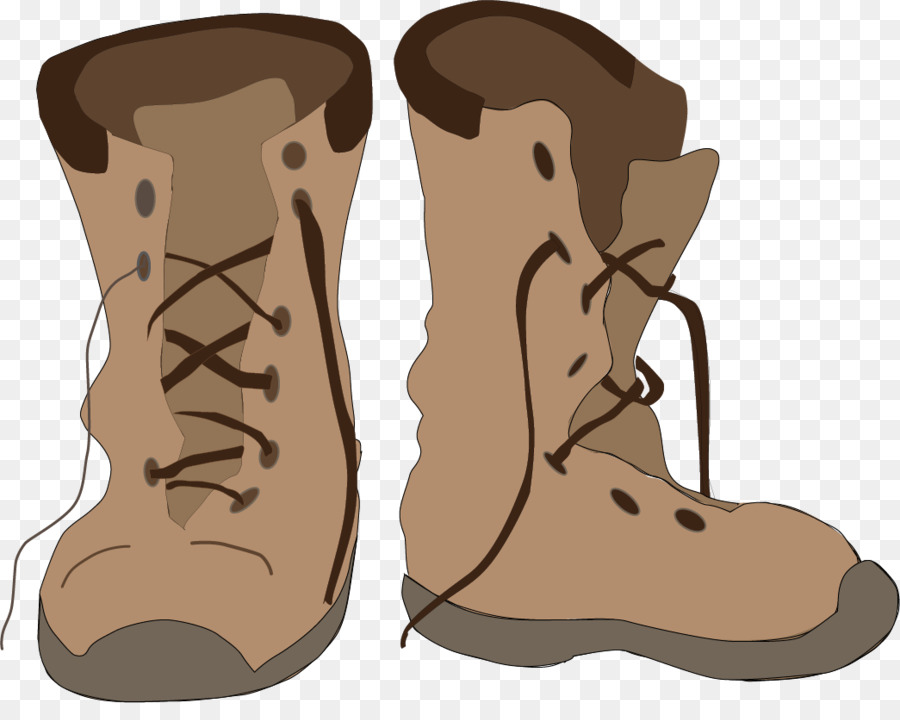

# Bootstrap-Portfolio

This repo is a homework assignment for the Penn LPS Coding Bootcamp. It is a basic website designed using the Bootstrap CDN and responsive web layout. It contains an About Me Page, a portfolio page with placeholder images, and a Contact Me Page. 

The background image for the site was sourced from <a href="https://subtlepatterns.com/">subtlepatterns.com</a> and  I used some fonts from Google Fonts for the page as well. 

